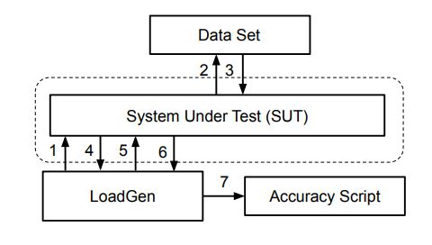
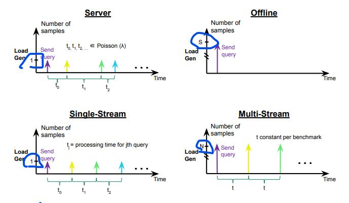

# MLPerf Inference
Reference: 
1. Rules: https://github.com/mlcommons/inference_policies/blob/master/inference_rules.adoc
2. Paper: Reddi, Vijay Janapa, et al. "Mlperf inference benchmark." 2020 ACM/IEEE 47th Annual International Symposium on Computer Architecture (ISCA). IEEE, 2020.
## Overview
* Goal: evaluating ML inference systems.
* Benchmark Suite: proper metrics, benchmark method(measure the inference performance).
* Chalenges: 1. diversity of **models**; 2. varety of deployment scenarios: **input data**'s **availability** and **arrival pattern**; 3. array of **inference systems**: application, data sets, models, frameworks, tool sets, lib, systems, platforms.
* Inference submission system contains: a system under test, loca generator, data set, accuracy script. 
### Definitions
* Sample: a sample is the **unit** on which **inference** is run, eg. an image, a sentence. 
* Query: a query is **a set of N samples** that are issued to an inference system **together**. N is a positive intenger, like a single query contains 8 images. 
* Quality: referes to a **model's ability** to produce **'correct'** outputs.
* System Under Test(SUT): consists of a defined **set of** hardware and software **resources** that will **be measured** for performance.  
(1) The **hardware** resources may include: processors, accelerators, memories, disks and interconnect.
(2) The **software** resources may include: an operating systems, compilers, libraries and drivers that significantly influnces the running time of a benchmark. 
* Reference Implementation: a specific **implementation** of a **benchmark** provided by the MLPerf organization. All valid submissions of a benchmark must be **equivalent** to the reference implementaion. 

## General Rules
### Non-determinism is trestricted
The only forms of acceptable non-determinism are: floating point operation order, randome traversal of the inputs, rounding. 
### Audit Process
In each round, up to two submissions will be audited: one at randome from all submissions, and either zero or one selected by the review committee.

## Scenarios
### Seneraio Details
* Single Stream: one by one; LoadGen sends next query as soon as SUT completes the previous query; mobile devices, client spplications where responsiveness is critial. 
* Server: randomly send; LoadGen sends new queries to the SUT according to a Poisson distribution; robotics, online applications. 
* Offline: all in one; LoadGen sends all samples to the SUT at start in a single query; cloud-based setups, batch-processing applications where all data is immediately available and latency is unconstrained. 
* Multistream: one set by one set; LoadGen sends next query as soon as SUT completes the previous query; autonomous vehicles, industrial-automation and remote-sensing tasks.

### Models and Definition of One Sample
| Model                                                 | Definition of one sample               |
|-------------------------------------------------------|----------------------------------------|
| Renet50-v1.5, SSD-ResNet34, SSD-MobileNet-v1, 3D UNET | one image                              |
| RNNT                                                  | one raw speech sample up to 15 seconds |
| BERT                                                  | one sequence                           |
| DLRM                                                  | up to 700 user-item pairs              |

## Benchmarks
Provides a **reference implementation** of **each benchmark**, includes: code implements **the model in a framework**.
### Constraints for Closed Division
* Two benchmark suites: 1. for datacneter systems; 2. for edge(non-datacenter) systems. 
* The Keywords for each model need to pay attenction to: **Area, Task, Model, Dataset, SQLSize, Quality, Server latency constraint(datacnter system only), Required Scenarios**. 
### quality targets
* per-model quality targets: We require that almost all implementations achieve a quality target within 1% of the FP32 reference model’s accuracy. 
* For example, the ResNet-50 v1.5 model achieves 76.46% Top-1 accuracy, and an equivalent model must achieve at least 75.70% Top-1 accuracy.

## Load Generator
### LoadGen Operation
* Defination: a traffic generator, loads the SUT and measures performance. 
* Modes: accuracy mode(goes through the entire data set); performance mode. 
* LoadGen is provided in **C++ with Python bindings**. 
#### Load Generator Responsibes:
* **Generating** the **queries** according to one of the scenarios.
* **Tracking** the **latency** of queries.
* **Validating** the **accuracy** of the results.
* **Computing** final **metrics**. 
#### Latency
Definition: the time from when the LoadGen was scheduled to pass a query to the SUT.
* Single Strem: single test run, 90th percentile latency; sends an inittial query then continually sends the next query as soon as the previous query is processed.
* Server: multiple test runs, each test evaluates a specific throughput value in queries-per-second(QPS). 
* Offline: single test run; sends all samples at once in a single query. 
* Multistream: a single test run, 99th percentile latency; sends an inittial query then continually sends the next query as soon as the previous query is processed.
#### Run Procedure
1. LoadGen **signals** system under test(SUT).
2. SUT starts up and **signals** rediness.
3. LoadGen starts **clock** and begins **generating queries**.
4. LoadGen stops generating queries as soon as the benchmark-specific minimum number of queries ahve been generated and the benchmark specific minimum time has elapsed.
5. LoadGen **waits** for all queires to **complete**, and errors if all queries fail to complete.
6. LoadGen computes **metrics** for the run.

  
#### Wheel
Q: What is the whl file? What does it used for?
* It is the LoadGen installation file. 
* Usage: 
1. Build the mlperf loadgen wheel(.whl) file.
2. Install the above whl file. 

## Divisions
### Closed Division
requires using pre-processing, post-processing, and model that is **equivalent** to the reference or alternative implementation. 
### Network Division
inherits all from closed division, and the SUT is **connected** to the **Loadgen system** over a **network** fabric. 
### Open Division
allows using artitrary pre- or post-processing and model, including retraining. 

## Data Sets
### Pointers
For each benchmark, will provide pointers to:
* An accuracy data set: quality target, used as validation set.
* A speed/performance data set: measure performance, a subset of accuracy data set. 
* A calibration data set: used for quantization. 

------------------------------------------------------------------------------------
# MLPerf™ Inference Benchmark Suite - Reading Codes
Reference: https://github.com/mlcommons/inference

## mlperf.conf and user.conf
mlperf.config: contains the overall settings like sample count, seed and each scenario's setting.
user.config: cser can optionally set this to higher values in user.conf.
## LoadGen
My understanding: the other parts' work is to prepare the dataset, load model and dataset, generate the SUT(system under test), SQL(Query Sample Library), and settings LoadGen used, then pass these values to LoadGen, and leverage LoadGen to do the actual benchmark thing. 

## vision - classification_and_detection
### folder
#### setup.py
Usage: build and install benchmark
Logics: after installed LoadGen; used python's setuptools to build and install the codes. 
#### run_local.sh
Usage: run locally.
Logics: calls python/main.py to run. 
#### run_and_time.sh
Usage: run as docker container.
Logics: choose Dockerfile by devide; build Docker image; use run_helper.sh to run. 
### python
* main.py: entrance, the major workflow trigger for all the things.
* Backend
* Runner
* Dataset
### models
The codes to convert models between frameworks.

## vision - medical_imaging
### 3d-unet-kits19
#### Overall
* Makefile: define each command's functionality.
* run.py: the major file to call the running of benchmarking.
* base_SUT.py: generate the basic and majority things of SUT for LoadGen. 
* framework_SUT.py: generate specific parts of SUT for LoadGen
#### Each File

## framework_SUT vs backend_framework
### Same
They all used LoadGen to do the benchmark:
* generate sut, sql, setting, inferencing method, etc.

### Differences
Different when dealing with different frameworks:
* backend_framework: used concept of **backend**; the inferencing method: **do_infer()**.
* framewor_SUT: used concpet of **SUT**; the inferencting method: **predict()**. 

----------------------------------------------------------------
# MLPerf™ Inference Benchmark Suite - Models
Reference: https://github.com/mlcommons/inference
* Definition: Is a **benchmark suite** for **measuring** how **fast** systems can **run models** in a variety of deployment scenarios. 

## Common Parts
### ThirdParty 
pybind: a lightweight header-only **library** that exposes C++ types in Python and vice versa, mainly to **create Python bindings of existing C++ code**. 
## Models
### Language
#### Bert
1. Area: Language. 
2. Task: Language Processing; question answering. 
3. Model: BERT-Large. 
4. Dataset: SQuAD v1.1 validation set. 
### Recommendation
#### DLRM
1. Area: Commerce
2. Task: Recommendation
3. Model:
4. Dateset: 1TB Click Logs
### Speech Recognition
#### RNNT
1. Area: Speech.
2. Task: Speech-to-text.
3. Model:
4. Dataset: Librispeech dev-clean (samples < 15 seconds).
### Vision
#### 3d-unet-kits19
1. Area: Vision.
2. Task: Medical image segmentation; kidney tumor segmentation task.
3. Model: 3D-UNet. 
4. Dataset: KiTS 2019. 
#### Renet50-v1.5
1. Area: Vision.
2. Task: Image classification.
3. Model:
4. Dataset: ImageNet (224x224).
#### SSD-ResNet34
1. Area: Vision.
2. Task: Object detection (large).
3. Model:
4. Dataset: COCO (1200x1200).
### Translation
#### GNMT
1. Area:
2. Task:
3. Model:
4. Dataset: 
